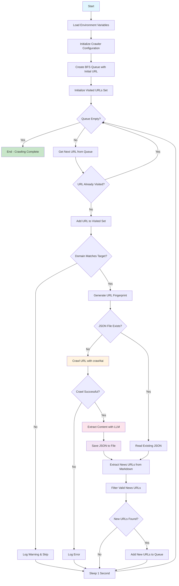

# News Crawler Project

A Python-based web crawler designed to automatically discover and extract news articles from merolagani.com using advanced AI-powered content extraction.

## Overview

This project implements a breadth-first search (BFS) crawler that:
- Starts from a seed news article URL
- Automatically discovers related news articles
- Extracts structured content using Large Language Models (LLM)
- Stores results in organized JSON files
- Maintains crawl state to avoid duplicate processing

## Features

- **Intelligent News Discovery**: Automatically finds news article links from crawled pages
- **AI-Powered Content Extraction**: Uses Gemini 2.0 Flash to extract structured data (title, content, URL, date)
- **Domain-Focused Crawling**: Restricts crawling to specified domain (merolagani.com)
- **Efficient Storage**: Organizes extracted data by domain and URL fingerprint
- **Resumable Crawling**: Skips already processed URLs to enable resumable crawls
- **Rate Limiting**: Built-in delays to be respectful to target servers

## Installation

### Prerequisites

- Python 3.12 or higher
- A Gemini API key (for content extraction)

### Setup

1. **Clone the repository**:
   ```bash
   git clone git@github.com:theArjun/crawl-news.git
   cd crawl-news
   ```

2. **Create and activate virtual environment**:
   ```bash
   uv venv
   ```

3. **Install dependencies**:
   ```bash
   uv pip install -r pyproject.toml
   ```

4. **Configure environment variables**:
   Create a `.env` file in the project root:
   ```
   GEMINI_API_KEY=your_gemini_api_key_here
   ```

## Usage

### Basic Usage

Run the crawler with the default configuration:

```bash
python main.py
```

This will start crawling from the initial URL defined in `main.py`.

### Configuration

You can modify the following parameters in `main.py`:

- **INITIAL_URL**: The starting URL for crawling
- **DATA_STORE_DIR**: Directory where extracted data will be stored
- **LLM Configuration**: Model provider, max tokens, and other LLM parameters
- **Crawl Delay**: Time between requests (currently 1 second)

### Output Structure

The crawler organizes extracted data as follows:

```
data/
└── merolagani.com/
    ├── <url_fingerprint_1>/
    │   └── result.json
    ├── <url_fingerprint_2>/
    │   └── result.json
    └── ...
```

Each `result.json` contains structured news data:
```json
{
  "title": "News Article Title",
  "content": "Full article content...",
  "url": "https://merolagani.com/NewsDetail.aspx?newsID=123",
  "date": "Article publication date"
}
```

## Code Flow



## Project Structure

```
crawl-news/
├── .env                    # Environment variables (API keys)
├── .gitignore             # Git ignore rules
├── main.py                # Main crawler application
├── pyproject.toml         # Project configuration
├── README.md              # This file
├── uv.lock               # Dependency lock file
├── data/                  # Extracted news data
│   └── merolagani.com/   # Domain-specific storage
└── .venv/                # Virtual environment
```

## Key Components

### NewsData Model
Pydantic model defining the structure of extracted news data:
- `title`: News article title
- `content`: Full article content
- `url`: Source URL
- `date`: Publication date

### URL Processing
- **Domain Validation**: Ensures crawling stays within target domain
- **URL Fingerprinting**: Creates unique identifiers for URLs
- **Link Extraction**: Regex-based extraction of news URLs from markdown content

### Content Extraction
- **LLM Integration**: Uses Gemini 2.0 Flash for structured content extraction
- **Content Filtering**: Removes low-quality content with minimum word thresholds
- **Markdown Generation**: Converts HTML to clean markdown format

## Configuration Options

### LLM Configuration
```python
llm_config = LLMConfig(
    provider="gemini/gemini-2.0-flash",
    max_tokens=1000,
    top_p=1.0,
    frequency_penalty=0.0,
)
```

### Crawler Configuration
```python
crawler_config = CrawlerRunConfig(
    markdown_generator=md_generator,
    extraction_strategy=LLMExtractionStrategy(
        llm_config=llm_config,
        schema=NewsData.model_json_schema(),
        extraction_type="schema",
        extraction_instruction="Extract the news data from the markdown content",
        verbose=True,
    ),
)
```

## Troubleshooting

### Common Issues

1. **API Key Errors**: Ensure your Gemini API key is correctly set in the `.env` file
2. **Rate Limiting**: Increase the sleep delay if you encounter rate limiting
3. **Memory Issues**: For large crawls, consider implementing batch processing
4. **Network Errors**: The crawler includes retry logic, but persistent errors may require manual intervention

### Logs

The application provides detailed logging at INFO level. To see debug information, modify the logging level in `main.py`:

```python
logging.basicConfig(level=logging.DEBUG)
```

## Contributing

1. Fork the repository
2. Create a feature branch
3. Make your changes
4. Add tests if applicable
5. Submit a pull request

## License

This project is open source. Please check the license file for details.
